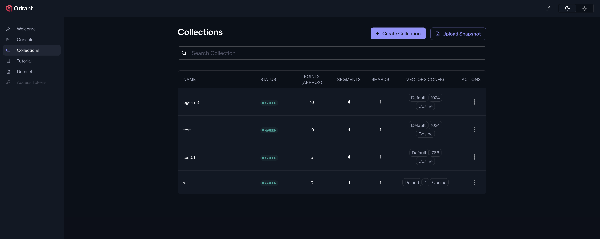
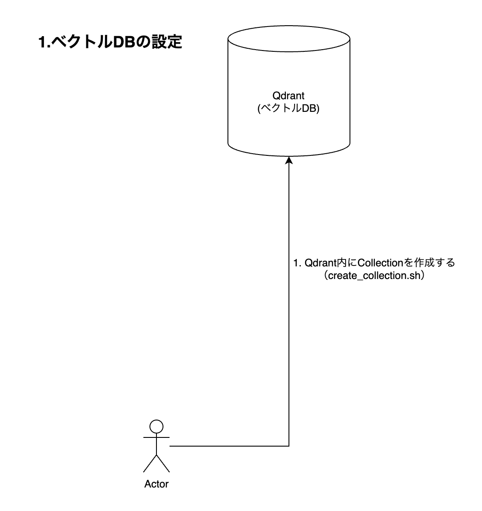
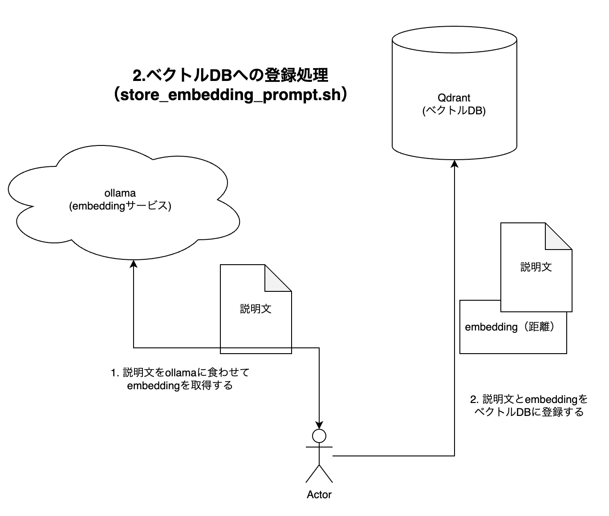

# similar search with vector db

## 初期セットアップ
1. コンテナ起動: `docker-compose up -d`
2. モデル取得: `docker exec -it ollama ollama pull bge-m3`
   - ollamaコンテナが起動している状態で実行する。
3. `http://localhost:6333/dashboard` でQdrant（vector db）のダッシュボードにアクセスできる。

## ベクトルDBについて
- ベクトルDBはRDBMSとは根本から異なるストレージサービス。
- ベクトルDBはMySQLのようなSQLクライアントではなく、REST API経由で操作を行う事を想定している。
- DB schemaのようなものはなく、Collectionという集合でpoint（値）を管理している。
- pointには以下の要素がある。
  - id: pointのID（UK）
  - vector: 距離。簡単にいうとx軸/y軸など、どこにあるかの数値。
  - payload: 格納している情報 ← ここがRDBMSでいう行にあたる。

## 全体像
- ollamaでテキストのembeddingを生成する（モデル: bge-m3）。
- 生成したベクトルをQdrantにポイントとして登録する。
- Qdrantに対して類似検索を実行し、近い説明文を返す。
- 登録するpromptは単語ではなく「説明文」を想定（例: 「エレキギター。アンプにつないで音を出す電気式の弦楽器。」）。

### 図解

## shフォルダのスクリプト

- `sh/create_collection.sh <collection_name>`: Qdrantのコレクション作成（1024次元、Cosine）。
- `sh/store_embedding_prompt.sh <collection_name> <point_id> <prompt>`: 説明文をembeddingし、Qdrantに単一ポイント登録。
- `sh/similar_search.sh <collection_name> <limit> <prompt>`: 入力した説明文をembeddingし、類似検索を実行。

### 検証用データの登録
`sh/setup__store_demo_point.sh <collection_name>` を実行すると、デモの説明文（楽器・飲食など10件）を一括で登録できる。
